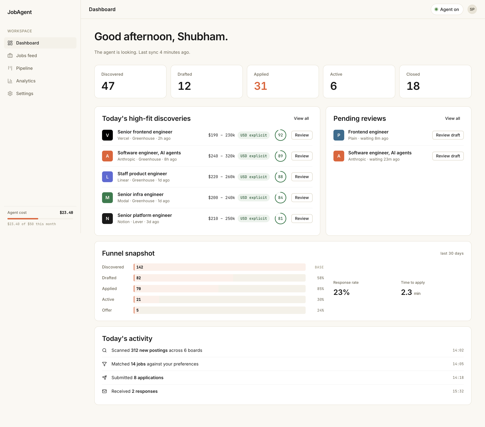
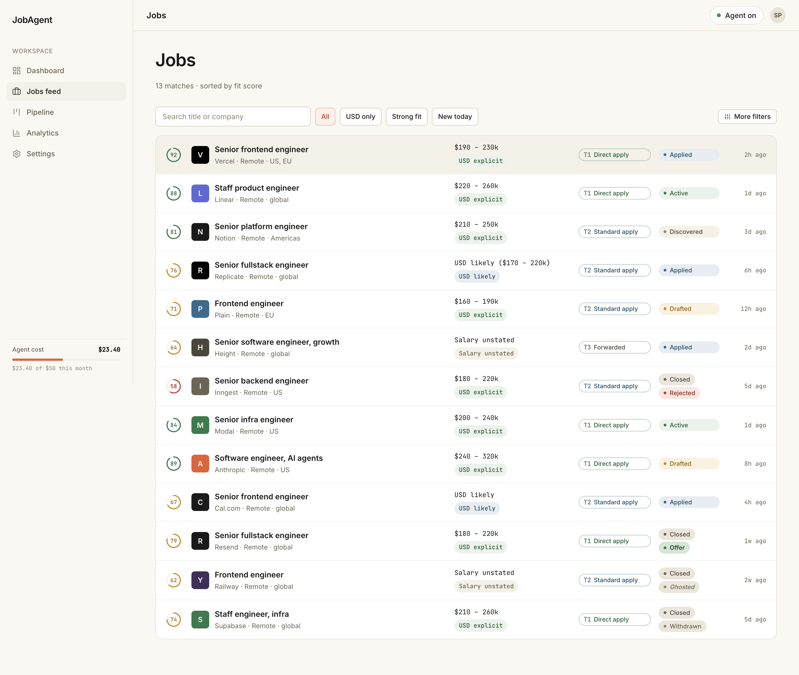
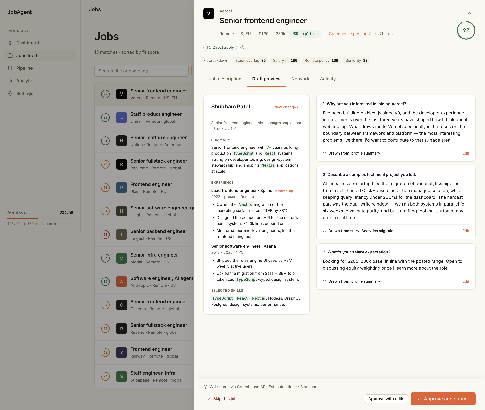
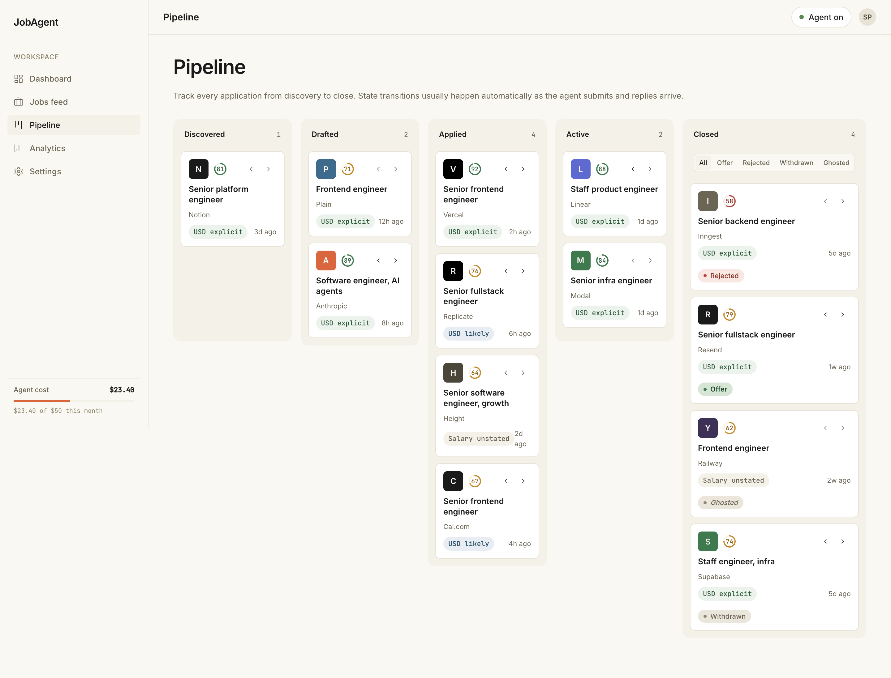
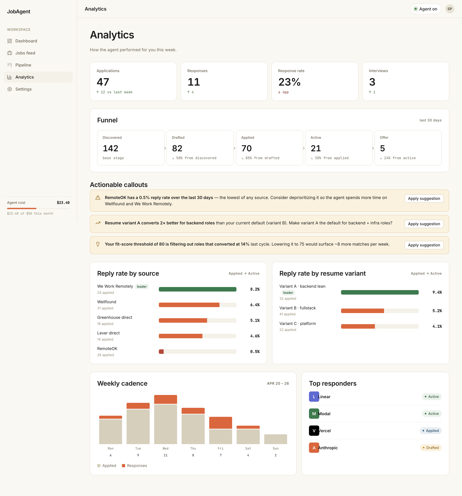
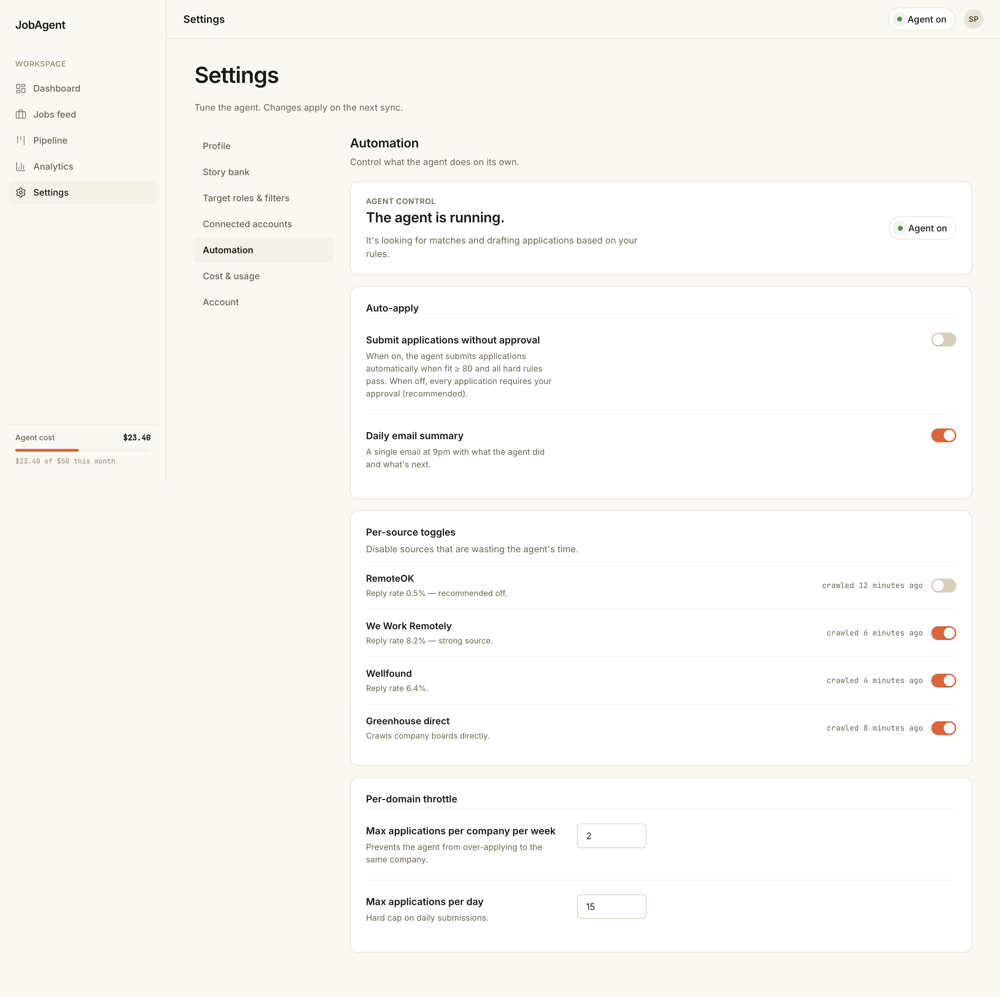
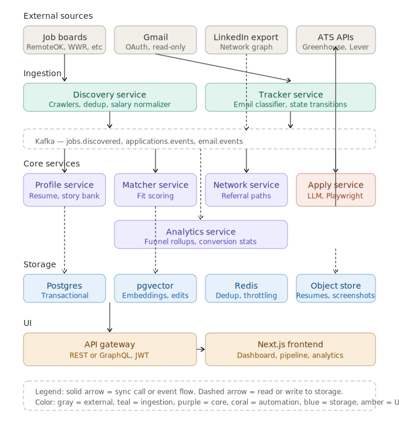

<div align="center">

# JobAgent

**An AI agent that finds remote, USD-paying engineering jobs and applies on your behalf.**

[]()
[](LICENSE)
[]()

[Documentation](#documentation) · [Quick start](#quick-start) · [Architecture](#architecture) · [Roadmap](#roadmap)

</div>

---

## What this is

Job hunting for remote, USD-paying roles is high-volume, low-signal work. Candidates fill near-identical forms across 50+ portals, generic resumes get filtered by ATS keyword matching before a human sees them, and tracking application state across email, LinkedIn DMs, and ATS portals is manual and error-prone.

JobAgent is a single tool that owns the full pipeline: **profile → discovery → fit scoring → tailoring → warm-intro check → application → tracking → learning.**

The agent builds a candidate profile from a resume and LinkedIn export, discovers remote USD-paying jobs across multiple sources, generates a JD-tailored resume and answers for each application using a personal "story bank," surfaces referral paths before falling back to cold-apply, and tracks every application through its full lifecycle using email crawling for state transitions. It learns from your edits to improve future drafts.

**Optimization target:** offers received per unit of candidate time — not applications submitted. A product that ships 30 well-targeted applications per week at a 15% reply rate beats one that ships 200 per week at 1%.

## Screenshots

> Screenshots from the live UI. Designs created with [Claude Design](https://claude.ai/design).

<table>
  <tr>
    <td></td>
    <td></td>
  </tr>
  <tr>
    <td align="center"><sub><b>Dashboard</b><br/>Pipeline counts, today's high-fit discoveries, pending reviews, funnel snapshot</sub></td>
    <td align="center"><sub><b>Jobs feed</b><br/>Filterable list with fit score, salary classification, tier badge, pipeline state</sub></td>
  </tr>
  <tr>
    <td></td>
    <td></td>
  </tr>
  <tr>
    <td align="center"><sub><b>Job detail — draft preview</b><br/>Tailored resume diff and Q&A drawn from the story bank, ready to approve</sub></td>
    <td align="center"><sub><b>Pipeline kanban</b><br/>5-column board (Discovered → Drafted → Applied → Active → Closed) with sub-tags</sub></td>
  </tr>
  <tr>
    <td></td>
    <td></td>
  </tr>
  <tr>
    <td align="center"><sub><b>Analytics</b><br/>Conversion funnel, reply rate by source and resume variant, actionable callouts</sub></td>
    <td align="center"><sub><b>Settings</b><br/>Agent rules, automation toggles, kill switch, connected accounts</sub></td>
  </tr>
</table>

## Why this is interesting

A few things make this more than a thin wrapper around an LLM.

**Offers, not applications.** Every feature is evaluated against reply rate and offers received, not application volume. Resume tailoring, fit scoring, and the referral path check exist because cold-apply at scale is a losing strategy.

**Story bank for long-form answers.** Generic LLM-generated answers to "Tell me about a time you led a difficult migration" are easy to spot. JobAgent maintains a structured library of the candidate's real narratives — situation, action, result, metrics, themes — and draws from it when a similar question appears. Each generated answer is attributed back to its source story.

**Salary normalization as a first-class problem.** "USD-paying" is the core hard filter, but real JDs say "competitive," "$120-180k DOE," "€90k+," "based on location." A dedicated pipeline classifies each job into `usd_explicit` / `usd_implied` / `unstated` / `non_usd` so the filter is honest about uncertainty rather than dropping half the feed.

**Three-tier submission model.** Auto-submitting via headless browser at scale gets fingerprinted by Greenhouse and Lever fast. The agent uses ATS APIs where reliable (Tier 1, ~60% of remote tech jobs), best-effort Playwright with throttling and captcha fallback for the rest (Tier 2), and a manual prepare-and-submit path when neither works (Tier 3). The user always sees which tier a job falls into before approving.

**Learning loop with attribution.** Every user edit is captured as `(question, context, original_answer, edited_answer)` and stored as embeddings. When a similar question appears later, the user's preferred phrasing is the starting draft — and the UI surfaces a "your phrasing is being used" indicator so the loop is visible.

**Email crawling for state transitions.** OAuth into Gmail, classify each new message (`ack` / `recruiter_contact` / `interview_scheduling` / `rejection` / `offer` / `irrelevant`), match to an Application via multi-signal scoring (sender domain → sender name → company mention → timestamp proximity), and update pipeline state without the user forwarding anything. Calendar invites are parsed as a special case.

**Human-in-the-loop, always.** Nothing auto-submits without review in v1. A global kill switch in the top nav halts all automation. Default settings are conservative.

## Architecture

JobAgent is a hybrid Java + Python microservices system communicating via Kafka, with a Next.js frontend.



**Seven logical services:**

- **Profile service** (Java/Spring Boot) — resume parsing, profile CRUD, versioning, story bank
- **Discovery service** (Java/Spring Boot) — per-source crawlers, deduper, salary normalizer
- **Matcher service** (Java/Spring Boot) — fit scoring against profile and filters
- **Network service** (Java/Spring Boot) — LinkedIn connection lookup, referral path detection
- **Apply service** (Python/FastAPI) — draft generation, resume tailoring, submission orchestration
- **Tracker service** (Java/Spring Boot) — email ingestion, classification, state transitions
- **Analytics service** (Java/Spring Boot) — funnel rollups, conversion stats, per-variant tracking

**Storage:** Postgres for transactional data, pgvector for embeddings (fit scoring + learning loop), Redis for crawler dedup and per-domain rate limiting, S3-compatible object store for resumes and submission screenshots.

**The Apply service is in Python** because Playwright and the LLM SDK are first-class there. Everything else is Java because that's the daily-driver stack and these services are largely orthogonal data plumbing — Spring Boot's ergonomics around Kafka, JPA, and Spring Security pay off.

For full architecture detail, data model, and service responsibilities, see [docs/architecture.md](docs/architecture.md).

## Quick start

> ⚠️ Phase 1 is in progress. Not all services are runnable yet. See [Roadmap](#roadmap) for what works today.

### Prerequisites

- Java 21+
- Python 3.11+
- Node.js 20+
- Docker and Docker Compose
- An Anthropic API key for the LLM-powered services

### Setup

```bash
# Clone the repo
git clone https://github.com/srshubham77/jobagent.git
cd jobagent

# Copy and edit environment variables
cp .env.example .env
# Set ANTHROPIC_API_KEY and other required values

# Bring up infrastructure (Postgres, Redis, Kafka)
docker compose up -d

# Run database migrations
./gradlew :profile-service:flywayMigrate

# Start the backend services (in separate terminals or via the run-all script)
./gradlew :profile-service:bootRun
./gradlew :discovery-service:bootRun
./gradlew :matcher-service:bootRun
cd services/apply && uvicorn main:app --reload

# Start the frontend
cd web && npm install && npm run dev
```

The app will be available at `http://localhost:3000`.

### Configuration

All sensitive configuration lives in `.env`. See `.env.example` for the full list. Required for Phase 1:

- `ANTHROPIC_API_KEY` — for draft generation, salary normalization, and email classification
- `DATABASE_URL` — Postgres connection string
- `REDIS_URL` — Redis connection string
- `KAFKA_BOOTSTRAP_SERVERS` — Kafka broker addresses

Optional, enabled in later phases:

- `GMAIL_OAUTH_CLIENT_ID` / `GMAIL_OAUTH_CLIENT_SECRET` — Tracker service (Phase 2)
- `GREENHOUSE_API_KEY`, `LEVER_API_KEY` — Tier 1 auto-submit (Phase 2)

## Documentation

- [docs/PRD.md](docs/PRD.md) — full product requirements, optimization target, scope, risks
- [docs/architecture.md](docs/architecture.md) — service breakdown, data model, key flows
- [docs/architecture.svg](docs/architecture.svg) — architecture diagram
- [docs/design-briefs.md](docs/design-briefs.md) — Claude Design briefs and design system tokens
- [docs/decisions/](docs/decisions/) — ADRs for significant decisions

## Roadmap

JobAgent ships in four phases. Detailed task tracking lives in the project's Notion workspace.

### Phase 1 — MVP (in progress)

- Profile builder from resume upload + story bank guided interview
- One discovery source: RemoteOK
- Salary normalization pipeline
- Fit scoring v1
- Manual apply: agent drafts, user copies, submits manually
- Three states: Discovered, Drafted, Applied (manual move)

**Success criteria:** drafted applications for 20 real jobs end-to-end without breaking; fit scores feel right after calibration.

### Phase 2 — Tailoring + auto-apply + tracking

- Per-application resume tailoring
- Add We Work Remotely, Wellfound, Hacker News "Who's Hiring"
- Tier 1 auto-submit via Greenhouse and Lever ATS APIs
- Email crawler with Gmail OAuth → Active and Closed states
- Duplicate application guard
- Kill switch

### Phase 3 — Network + learning

- LinkedIn manual export ingestion
- Referral path detection
- Learning loop with answer retrieval (pgvector)
- Recruiter contact enrichment
- Tier 2 Playwright auto-submit with throttling and captcha fallback

### Phase 4 — Analytics + polish

- Funnel view with breakdowns
- Multi-resume variant analytics
- Pipeline kanban view
- Notifications (new high-fit jobs, recruiter replies)

## Project structure

```
jobagent/
├── docs/                       # PRD, architecture, ADRs, design briefs
│   ├── PRD.md
│   ├── architecture.md
│   ├── architecture.svg
│   ├── design-briefs.md
│   ├── decisions/              # ADRs
│   └── screenshots/            # UI screenshots for the README
├── services/
│   ├── profile/                # Java/Spring Boot — profile + story bank
│   ├── discovery/              # Java/Spring Boot — crawlers + salary normalizer
│   ├── matcher/                # Java/Spring Boot — fit scoring
│   ├── network/                # Java/Spring Boot — LinkedIn + referrals
│   ├── tracker/                # Java/Spring Boot — email ingestion
│   ├── analytics/              # Java/Spring Boot — funnel rollups
│   └── apply/                  # Python/FastAPI — draft gen + Playwright
├── web/                        # Next.js + Tailwind + shadcn/ui frontend
├── infra/                      # Docker Compose, Kubernetes manifests, CI
├── .env.example
└── README.md
```

## Tech stack

| Layer | Choice | Why |
|---|---|---|
| Backend (data services) | Java 21, Spring Boot 3 | Daily-driver stack; mature Kafka/JPA/Security ergonomics |
| Backend (apply service) | Python 3.11, FastAPI | Playwright and LLM SDKs are first-class in Python |
| Async messaging | Kafka | Familiar; per-source isolation; replay friendly |
| Storage (transactional) | Postgres + pgvector | Single store for relational data and embeddings |
| Storage (cache, throttle) | Redis | Crawler dedup keys, per-domain rate limit tokens |
| Storage (blobs) | S3-compatible | Resumes, generated variants, submission screenshots |
| Browser automation | Playwright (Python) | Tier 2 submission for non-API ATSes |
| LLM | Claude (Anthropic API) | Drafting, salary normalization, email classification |
| Frontend | Next.js 14, Tailwind, shadcn/ui | Fast iteration; design system maps cleanly to components |
| Auth | OAuth 2.0 (Google, LinkedIn export), JWT for sessions | Standard |
| Local infra | Docker Compose | One-command bring-up of Postgres + Redis + Kafka |
| Hosted infra | Kubernetes | Familiar; scales horizontally per service |
| CI | GitHub Actions | Standard |

## Status and limitations

**This is a portfolio project, built in evenings.** It is not a hosted product, has no waitlist, and is not accepting users. The roadmap above is a real plan I'm executing, not a marketing artifact.

**Known limitations and explicit non-goals:**

- v1 is single-user. No multi-tenancy, team mode, or agency mode.
- No mobile app. Mobile web is a stacked single-column fallback, not a designed experience.
- LinkedIn discovery is excluded from v1 sources due to legal risk (hiQ v. LinkedIn). The network/referral feature uses manual LinkedIn data export, not scraping.
- Nothing auto-submits without human review in v1. The kill switch always halts automation.
- The product targets remote, USD-paying roles. INR-paying or India-only roles are out of scope.

## Contributing

I'm not actively soliciting contributions while Phase 1 is in flight, but if you have ideas, found a bug, or want to discuss the design:

- Open a [GitHub issue](https://github.com/srshubham77/jobagent/issues) — bug reports, feature ideas, architecture questions all welcome
- For larger discussions, start a [Discussion](https://github.com/srshubham77/jobagent/discussions)
- PRs are welcome but please open an issue first to discuss scope

If you want to fork and run your own instance: go for it. The license permits it. The codebase is set up for single-user deployment.

## License

MIT — see [LICENSE](LICENSE).

## Acknowledgments

- Architecture and product decisions documented in [docs/decisions/](docs/decisions/) — these capture the reasoning behind tradeoffs that aren't obvious from the code alone.
- UI design built with [Claude Design](https://claude.ai/design); design tokens and screen briefs live in [docs/design-briefs.md](docs/design-briefs.md).
- The PRD reflects feedback rounds that pushed the design from "tool that ships applications" to "tool that gets offers." That reframing — primary metric is offers received, not application volume — drove most of the feature priority decisions in Phase 1 and 2.

---

<div align="center">
<sub>Built by <a href="https://github.com/srshubham77">srshubham77</a> · <a href="docs/PRD.md">PRD</a> · <a href="docs/architecture.md">Architecture</a></sub>
</div>
